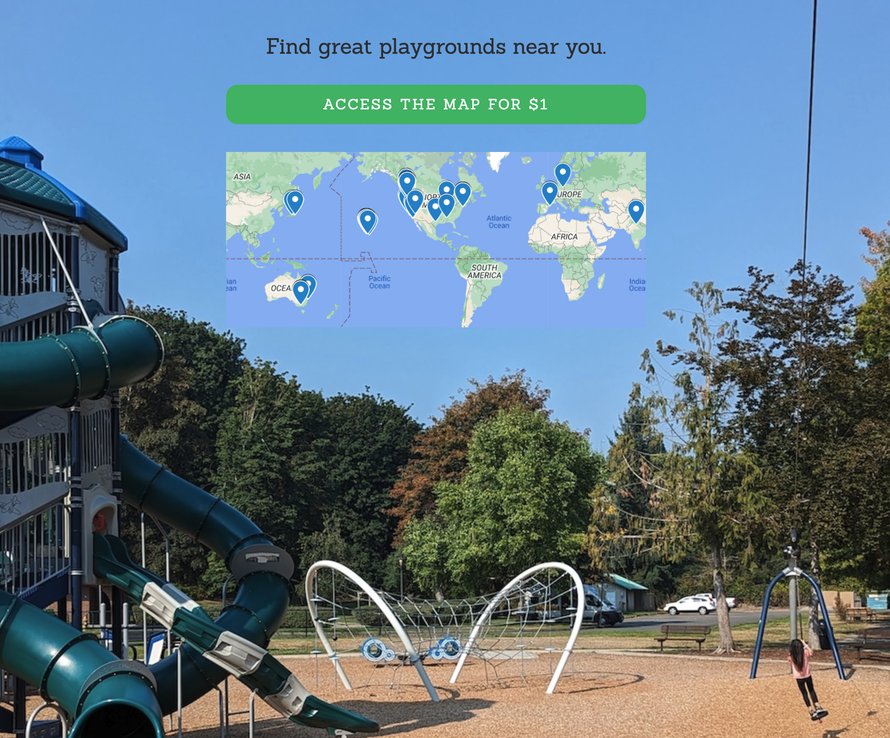

# PlayGroundFinder 🏞️

An AI-powered web application that analyzes playground photos to extract structured information about playground features, age ranges, and safety considerations.

## What It Does

PlayGroundFinder uses computer vision and AI to automatically analyze uploaded playground photos and extract:

- **Features detected**: slides, swings, monkey bars, climbing structures, etc.
- **Age range recommendations**: estimated appropriate age groups
- **Safety information**: child detection, privacy concerns
- **Location details**: when available from image metadata


*The app identifies playground features and provides structured data like age ranges and directions.*

## Project Structure

This project includes both Flask and FastAPI implementations:

### Flask App (`flask_app/`)
- Web interface for uploading and viewing playground photos
- Template-based UI with upload forms and result display
- Image processing and AI analysis integration

### FastAPI App (`fastapi_app/`)
- REST API for programmatic access
- Database integration with SQLAlchemy
- CRUD operations for playground data

### Common Components (`common/`)
- **Schemas**: Pydantic models for data validation
- **Utils**: Image processing and AI analysis utilities
- **Models**: Database models and structures

## Key Features

- 📸 **Image Upload**: Support for PNG, JPG, JPEG, GIF, WebP formats
- 🤖 **AI Analysis**: Uses Anthropic Claude for intelligent image analysis
- 🏗️ **Feature Detection**: Automatically identifies playground equipment
- 👶 **Age Assessment**: Estimates appropriate age ranges
- 🔒 **Privacy Protection**: Detects children in photos for blurring recommendations
- 💾 **Data Storage**: Persistent storage of analysis results
- 🌐 **Dual Interface**: Both web UI and REST API access

## Technology Stack

- **Backend**: Python, Flask, FastAPI
- **AI/ML**: Anthropic Claude, Instructor library
- **Database**: SQLAlchemy (SQLite)
- **Image Processing**: Pillow
- **Data Validation**: Pydantic
- **Frontend**: HTML templates with Jinja2

## Getting Started

1. **Install Dependencies**:
   ```bash
   pip install -r requirements.txt
   ```

2. **Set Environment Variables**:
   ```bash
   export ANTHROPIC_API_KEY=your_api_key_here
   ```

3. **Run Flask App**:
   ```bash
   cd flask_app
   python app.py
   ```
   Visit: http://127.0.0.1:5000

4. **Run FastAPI App**:
   ```bash
   cd fastapi_app
   uvicorn fastapi_main:app --reload
   ```
   Visit: http://127.0.0.1:8000

## API Usage

### Upload and Analyze Image
```bash
curl -X POST "http://127.0.0.1:8000/upload/" \
     -F "file=@playground_photo.jpg"
```

### Get Analysis Results
```bash
curl "http://127.0.0.1:8000/playground_images/"
```

## Data Models

### PlaygroundImage
- `url`: Image file path
- `taken_at`: Timestamp
- `children_detected`: Boolean for privacy
- `needs_face_blurring`: Privacy recommendation
- `estimated_age_range`: Min/max age values
- `features_detected`: List of playground equipment

### PlaygroundFeature
- `primary_name`: Main feature name
- `aliases`: Alternative names/variations

## Live Prototype

🌐 **See it in action**: [playgroundfinder.webflow.io](https://playgroundfinder.webflow.io/)



This repository contains the **AI analysis backend** that powers playground data extraction. The live prototype showcases the **user-facing application** where parents and caregivers can:

- 🗺️ **Browse interactive maps** of analyzed playgrounds
- 💎 **Access premium content** through a simple $1 subscription model  
- 📍 **Discover local play spaces** with detailed feature information
- 📊 **View structured data** generated by this AI analysis system

The Webflow prototype demonstrates the complete user journey - from discovering playgrounds on a map to accessing detailed information that's been automatically extracted using the AI models in this codebase. This creates a full pipeline: **AI analysis** (this repo) → **Structured playground data** → **User-friendly discovery platform** (Webflow site).

## Development Status

This project was developed as a proof-of-concept for AI-powered playground analysis. Current status:

- ✅ Core image analysis functionality
- ✅ Web interface for uploads
- ✅ REST API for programmatic access
- ✅ Data persistence and retrieval
- 🔄 Ongoing refinements to AI accuracy
- 🔄 UI/UX improvements

## Future Enhancements

- Mobile-responsive design
- Batch image processing
- Geographic mapping integration
- Advanced safety assessments
- Community features and reviews
- Export functionality for park departments

---

*This app helps parents, caregivers, and park planners quickly assess playground suitability and features through automated image analysis.*